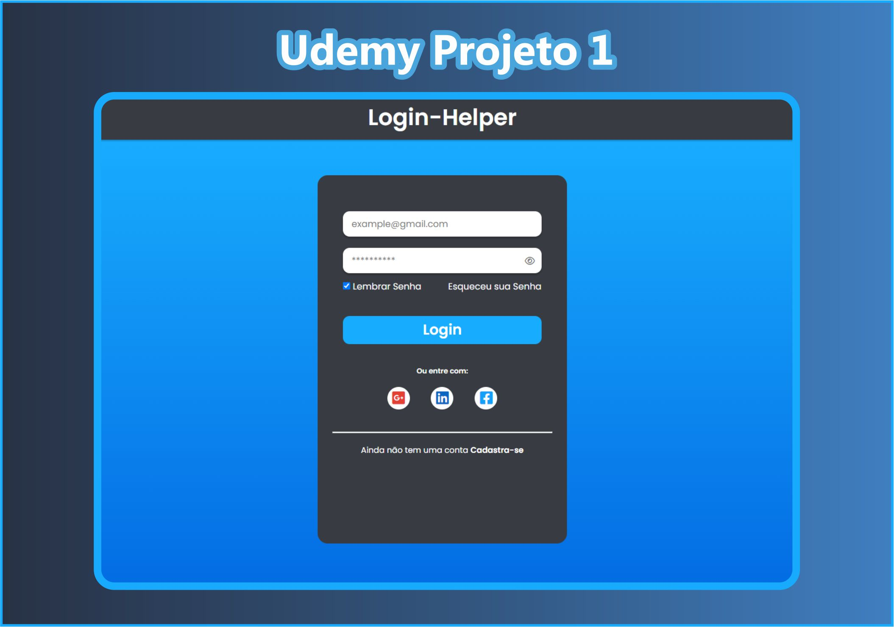
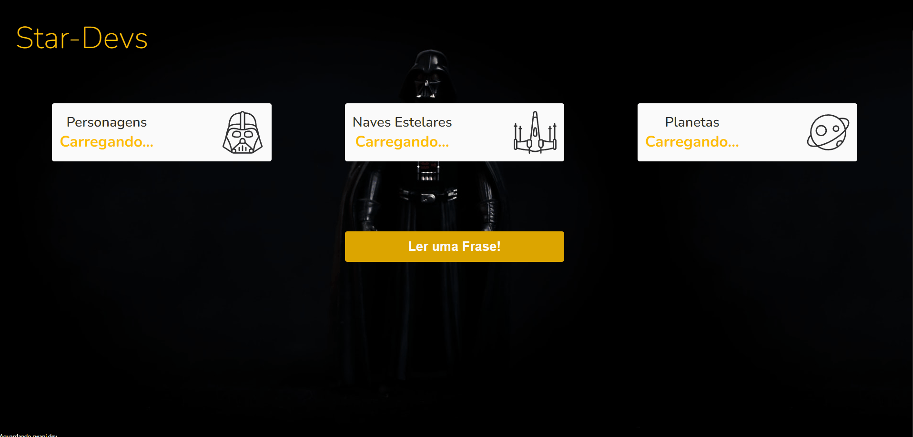

# Apendizado Udemy

Sessão de aprendizados videos da Udemy...

## <a href="./1-Tela-Login"> 1 - Tela de Login </a>

### Tech: HTML, CSS e JavasSript

Aprendi a criar um layout de login, aonde possui mostrar senha ou não.

  

## <a href="./2-Adivinha Número"> 2 - Adivinha Numero </a>

### Tech: HTML, CSS e JavasSript

Criado um simples adivinha numero com Javascript.

  

## <a href="./3-Consumir-API"> 3 - Consumindo uma API </a>

### Tech: HTML, CSS e JavasSript

Consumindo uma API com javascript

